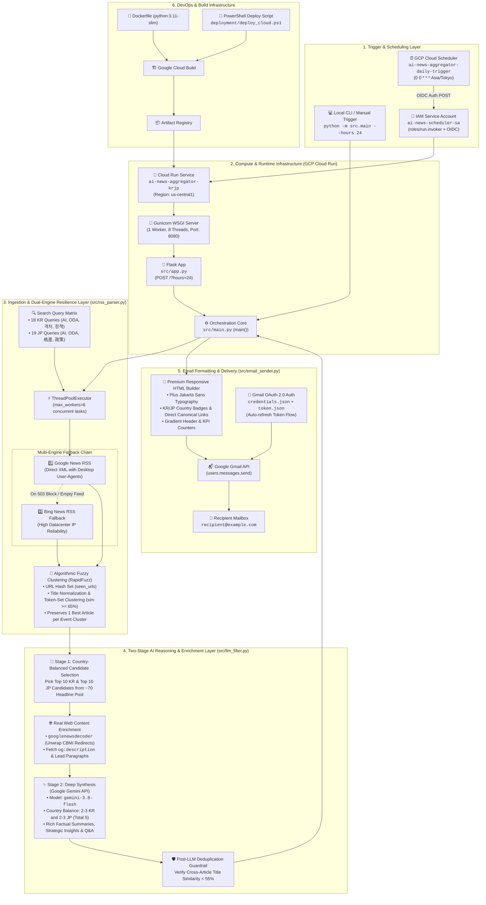
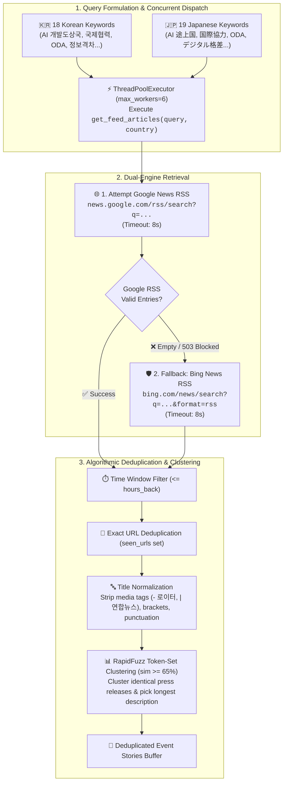

# AIFOD Daily AI News Aggregator (Korea & Japan)

A Python-based serverless service that fetches AI-related news from South Korea and Japan, filters them for relevance to AIFOD's mission, algorithmically deduplicates press releases and similar stories via fuzzy title clustering, enriches candidate articles with real publisher content, translates and deeply synthesizes the top 5 most impactful stories in English with guaranteed country balance (including AIFOD strategic insights and practitioner Q&As), and emails a daily digest to the practitioner every day at midnight (`Asia/Tokyo` time).

Deployed on Google Cloud Run and scheduled via Google Cloud Scheduler.

---

## Architecture & System Flowcharts

### 1. High-Level Infrastructure Overview



---

### 2. Two-Stage AI Selection & Deep Synthesis Pipeline

```mermaid
flowchart TD
    %% Input Articles
    subgraph InputStage ["1. Deduplicated Event Pool (src/rss_parser.py)"]
        RAW_FEED["📥 400+ Raw Articles Fetched"]
        FUZZ_CLUSTER["🧹 RapidFuzz Title Clustering<br/>Group identical press releases into single events"]
        SPLIT_POOLS["👥 Initial Pool: Up to 70 Headlines<br/>• KR Pool (Top 35 Date-Sorted)<br/>• JP Pool (Top 35 Date-Sorted)"]
    end

    %% Stage 1 Candidate Selection
    subgraph Stage1 ["2. Stage 1: Candidate Selection (Gemini API)"]
        S1_PROMPT["🧠 Candidate Selection Prompt<br/>Filter for AIFOD Mission Alignment & Thematic Diversity"]
        S1_SELECT["🎯 Select Top 20 Candidates<br/>(10 from KR + 10 from JP)"]
    end

    %% Web Content Enrichment
    subgraph EnrichmentStage ["3. Real Web Content & Canonical URL Enrichment"]
        DECODER["🔓 <code>googlenewsdecoder</code><br/>Unwrap Google News CBMi redirects to canonical publisher URLs"]
        FETCHER["🌐 Parallel Metadata Extraction<br/>Extract <code>og:description</code>, meta descriptions & lead paragraphs (~1000 chars)"]
        ENRICHED_DATA["📑 Enriched Candidate Payloads (20 Articles)"]
    end

    %% Stage 2 Deep Synthesis
    subgraph Stage2 ["4. Stage 2: Deep Factual Synthesis (Gemini API)"]
        S2_PROMPT["🧠 Deep Synthesis Prompt<br/>Enforce country balance (2-3 KR, 2-3 JP) & rich factual density"]
        S2_OUTPUT["📋 Structured JSON Generation (Final 5 Stories):<br/>• english_title<br/>• english_summary (3-4 dense factual sentences)<br/>• aifod_insight (Strategic implications for Global South)<br/>• aifod_question (Critical policy dilemma)<br/>• aifod_suggested_answer (Actionable stance)"]
    end

    %% Post-Guardrail
    subgraph GuardrailStage ["5. Post-Generation Verification Guardrail"]
        SIM_CHECK{"Check Pairwise Title<br/>Similarity < 55%?"}
        POST_VERIFY["✅ Verified Balanced Top 5 Digest"]
        SUB_ALT["🔁 Substitute with Unused Candidate"]
    end

    %% Connections
    RAW_FEED --> FUZZ_CLUSTER --> SPLIT_POOLS
    SPLIT_POOLS --> S1_PROMPT --> S1_SELECT
    S1_SELECT --> DECODER --> FETCHER --> ENRICHED_DATA
    ENRICHED_DATA --> S2_PROMPT --> S2_OUTPUT
    S2_OUTPUT --> SIM_CHECK
    SIM_CHECK -- "Pass" --> POST_VERIFY
    SIM_CHECK -- "Duplicate Found" --> SUB_ALT --> POST_VERIFY
```



---

### 3. Data Ingestion & Fallback Pipeline



---

## Features

- **Resilient Dual-Engine Retrieval**: Queries Google News RSS feeds for South Korea and Japan using AIFOD-targeted keywords. Automatically falls back to Bing News RSS if Google News blocks cloud egress IPs or returns empty feeds.
- **Algorithmic Fuzzy Deduplication**: Eliminates identical press releases across multiple news outlets using RapidFuzz token-set title clustering (`token_set_ratio >= 65`). Merges duplicate coverage into a single best-quality article before AI evaluation.
- **Article Content Enrichment**: Resolves Google News `CBMi...` redirects to canonical publisher URLs via `googlenewsdecoder` and fetches real article metadata (`og:description`, `meta[name="description"]`, and lead paragraphs).
- **Two-Stage Country-Balanced AI Pipeline**:
  - **Initial Headline Pool**: Ingests an initial pool of up to 70 deduplicated headlines (up to 35 date-sorted headlines from South Korea and 35 from Japan) evaluated for AIFOD mission relevance.
  - **Stage 1**: Selects 10 candidate stories from South Korea and 10 from Japan (total 20 candidates, configurable via `STAGE1_CANDIDATES_PER_COUNTRY`).
  - **Content Enrichment**: Enriches all 20 candidates concurrently with canonical publisher URLs, `og:description`, and full lead paragraphs.
  - **Stage 2**: Evaluates enriched texts and generates a strictly balanced 5-article digest (**2-3 from Korea and 2-3 from Japan**) using rich source text.
- **High-Density AIFOD Deliverables**:
  - **English Summary**: 3-4 dense, factual sentences naming specific actors, partner countries, dates, venues, and policies.
  - **AIFOD Strategic Insight**: Analytical "So What?" highlighting implications for the Global South without restating summary facts.
  - **Practitioner Discussion Q&A**: A forward-looking policy dilemma paired with an actionable stance representing AIFOD's perspective.
- **Premium Email Digests**: Compiles a responsive, beautifully styled HTML email with country badges, direct publisher links, and KPI metrics sent directly via the Gmail API.
- **GCP Serverless Native**: Fully containerized for Google Cloud Run, triggered securely with OIDC authentication by Cloud Scheduler.

---

## 📬 Sample Daily Digest Output Preview

Below is an authentic visual preview of the daily email digest delivered directly to the practitioner's inbox via Gmail:

> [!NOTE]
> ### 📬 AIFOD Daily Intelligence Briefing — Korea & Japan AI News
> *Selected and synthesized for international development relevance and policy strategy.*
> 
> | 📊 Evaluated | 🎯 Selected | ⚖️ Country Balance | 🗓️ Date |
> | :---: | :---: | :---: | :---: |
> | **248 articles** | **5 stories** | **🇰🇷 3 Korea &nbsp;·&nbsp; 🇯🇵 2 Japan** | **Sep 16, 2026** |

#### 🇰🇷 [South Korea's MSIT and KOICA Launch $45M AI Capacity-Building Initiative for ASEAN Partner Nations](https://en.yna.co.kr)
`🇰🇷 South Korea` &nbsp;·&nbsp; **Yonhap News** &bull; *Sep 16, 02:30 UTC*  
*Original: 과기정통부-KOICA, 아세안 개도국 대상 600억원 규모 디지털 AI 역량강화 ODA 사업 착수*

South Korea's Ministry of Science and ICT (MSIT), in partnership with KOICA, officially launched a 60 billion KRW ($45M) multi-year ODA initiative on September 15, 2026, aimed at establishing sovereign AI training centers across Indonesia, Vietnam, and the Philippines. The program deploys open-source Korean large language models fine-tuned on local Southeast Asian languages alongside cloud compute subsidies and technical faculty training. Pilot programs will commence in Q1 2027 in Jakarta and Hanoi to develop public sector AI services for healthcare and agricultural monitoring.

> [!IMPORTANT]
> **AIFOD Strategic Insight**  
> This initiative reflects a crucial shift from generic ICT hardware donations toward high-value sovereign AI capability building in the Global South. For AIFOD, the focus on local language fine-tuning and public sector use cases provides an actionable precedent for avoiding technological dependency on single-nation proprietary LLMs.

> [!TIP]
> **Practitioner Q&A & Stance**  
> **Q: How can developing nation partner agencies prevent compute infrastructure gifts from becoming unsustainable once foreign donor subsidies expire?**  
> 
> **AIFOD Stance:** Multilateral ODA agreements must incorporate tiered local financing roadmaps and prioritize energy-efficient, edge-deployable open-weights models rather than relying indefinitely on recurring high-overhead cloud computing grants.

---

#### 🇯🇵 [Japan's METI and JICA Partner on AI Governance Framework for Global South Industrial Cooperation](https://asia.nikkei.com)
`🇯🇵 Japan` &nbsp;·&nbsp; **Nikkei Asia** &bull; *Sep 16, 04:15 UTC*  
*Original: 経済産業省とJICA、グローバルサウス向けAIガバナンス指針と産業応用支援枠組みを共同策定*

Japan's Ministry of Economy, Trade and Industry (METI) and JICA unveiled a comprehensive AI governance guideline on September 15, 2026, specifically tailored for emerging economies across South and Southeast Asia. The framework provides risk-based safety standards aligned with the Hiroshima AI Process while establishing collaborative testing testbeds for SME manufacturing and disaster risk prediction. JICA has earmarked 18 billion JPY over three fiscal years to assist partner ministries in developing their own national regulatory sandboxes.

> [!IMPORTANT]
> **AIFOD Strategic Insight**  
> Aligning developing economy AI frameworks with the Hiroshima AI Process helps Global South economies participate in global AI supply chains without premature over-regulation. AIFOD practitioners should leverage these Japanese bilateral sandboxes to advocate for inclusive IP protections and local algorithmic fairness standards.

> [!TIP]
> **Practitioner Q&A & Stance**  
> **Q: How can developing nation regulators balance rigorous AI risk compliance with urgent local economic innovation demands?**  
> 
> **AIFOD Stance:** Regulators should adopt agile sandbox models that grant provisional compliance exemptions to high-impact developmental use cases (such as agricultural AI and micro-finance credit scoring) while retaining strict safeguards for citizen biometric data.

---

## Multi-PC Cloud-Native Architecture

This repository is built on a fully portable, multi-PC cloud-native architecture. Developers and automated pipelines can run the project on ANY workstation or Cloud Run container without creating or maintaining local credential files or `.env` files.

### Cloud Service Mapping

| Layer | Google Cloud Service | Canonical Resource | Resolution & Portability Strategy |
| :--- | :--- | :--- | :--- |
| **API Keys & Secrets** | **Secret Manager** | `secrets/gemini-api-key/versions/latest` | Resolved via Python SDK on Cloud Run; auto-fallback to `gcloud secrets versions access` CLI on local workstations. |
| **OAuth 2.0 Tokens** | **Secret Manager** | `secrets/gmail-agent-token/versions/latest` | Resolved from Secret Manager; refreshed in-memory; updated in Secret Manager automatically; cached only in OS temp dir (`tempfile.gettempdir()`). |
| **OAuth Client Config** | **Secret Manager** | `secrets/gmail-oauth-credentials/versions/latest` | Loaded directly from Secret Manager when interactive browser authorization is needed. |
| **Persistent State** | **Cloud Storage (GCS)** | `gs://<project-id>-ai-news-data/ai-news-aggregator-krjp/state.json` | Single source of truth for delivered article URLs, hashes, and run counters; local cache strictly in OS temp directory. |
| **Operational & Audit Logs** | **GCS & Cloud Logging** | `gs://<project-id>-ai-news-data/ai-news-aggregator-krjp/run_log.json` + `stdout` | Decoupled from memory/state; structured JSON logs emitted to `stdout` for streaming to Google Cloud Logging. |

### Environment Variables & Local Overrides

In this cloud-native architecture, environment variables can be provided via Google Cloud Run environment settings or an optional local `.env` file (see [.env.example](.env.example)):

| Variable | Description | Default | Source / Fallback |
| :--- | :--- | :--- | :--- |
| `GCP_PROJECT_ID` | Google Cloud Platform project ID | Auto-resolved | Resolves from `gcloud config get-value project` |
| `GCP_REGION` | Cloud Run and Scheduler region | `us-central1` | Environment or CLI parameter |
| `SERVICE_NAME` | Cloud Run service name | `ai-news-aggregator-krjp` | Environment or CLI parameter |
| `JOB_NAME` | Cloud Scheduler job name | `ai-news-aggregator-daily-trigger` | Environment or CLI parameter |
| `GEMINI_MODEL` | Google Gemini model name | `gemini-3.8-flash` | Configurable model identifier |
| `STAGE1_CANDIDATES_PER_COUNTRY` | Candidates selected per country in Stage 1 | `10` | 10 KR + 10 JP = 20 total candidates |
| `GEMINI_API_KEY` | Gemini API authentication key | Secret Manager | Secret `gemini-api-key` |
| `RECIPIENT_EMAIL` | Target email address for daily digest | Secret Manager | Secret `ai-news-recipient-email` |
| `RECIPIENT_NAME` | Recipient name for digest personalization | `AIFOD Practitioner` | Local environment override |
| `TIMEZONE` | Timezone for report dates and scheduling | `Asia/Tokyo` | Standard IANA timezone string |

---

## Project Structure

```text
AI-news-aggregator-KRJP/
├── src/                               # Application Package
│   ├── __init__.py                    # Package initialization
│   ├── app.py                         # Flask web service entry point for Cloud Run (?hours=24&dry_run=true)
│   ├── auth.py                        # Dual-mode Secret Manager Gmail OAuth loader & refresh
│   ├── config.py                      # Secret Manager resolution, GCS configuration & search queries
│   ├── email_sender.py                # HTML email generator & Gmail REST API sender
│   ├── llm_filter.py                  # Two-stage candidate selection, enrichment & synthesis
│   ├── main.py                        # Orchestration pipeline, CLI entrypoint & --dry-run support
│   ├── memory.py                      # GCS state persistence & decoupled operational run logging
│   └── rss_parser.py                  # Dual-engine RSS fetcher, RapidFuzz clustering, enrichment
├── deployment/
│   ├── deploy_cloud.ps1               # Automated deployment script (APIs, GCS bucket, IAM, Cloud Run, Scheduler)
│   └── sync_secrets.py                # One-shot utility to push local credentials to Secret Manager
├── .env.example                       # Cloud architecture environment template
├── .gcloudignore                      # Cloud Build ignore rules
├── .gitignore                         # Strict Git ignore rules ensuring zero credential/state pollution
├── Dockerfile                         # Production container definition (python:3.11-slim)
├── LICENSE                            # MIT License definition
├── requirements.txt                   # Python dependencies (includes google-cloud-secret-manager & storage)
└── README.md                          # Project documentation (this file)
```

Key files:
- [src/config.py](src/config.py): Implements `resolve_cloud_secret` and `save_cloud_secret` with dual-mode fallback (SDK + `gcloud` CLI).
- [src/auth.py](src/auth.py): Resolves Gmail OAuth tokens from Secret Manager without requiring local `token.json` or `credentials.json`.
- [src/memory.py](src/memory.py): Persists delivery state (`state.json`) and audit logs (`run_log.json`) to Google Cloud Storage.
- [src/main.py](src/main.py): Primary orchestrator supporting lookback windows, state deduplication, and `--dry-run`.
- [deployment/sync_secrets.py](deployment/sync_secrets.py): One-shot utility to synchronize local tokens or keys to Secret Manager.
- [deployment/deploy_cloud.ps1](deployment/deploy_cloud.ps1): Complete infrastructure deployment script.

---

## Multi-PC Zero-Setup & Execution

### 1. Prerequisites (Any Machine)
Clone the repository on any computer. You only need:
- Python 3.11+
- Google Cloud SDK (`gcloud`)

Authenticate your workstation once:
```bash
gcloud auth login
gcloud config set project YOUR_GCP_PROJECT_ID
```

Install dependencies:
```bash
pip install -r requirements.txt
```

### 2. Zero-Setup Local Dry-Run
Run the complete pipeline end-to-end with **ZERO** local `.env`, `credentials.json`, or `token.json` files:

```bash
# Execute dry-run (fetches news, clusters, runs Gemini, verifies HTML compilation without sending email)
python -m src.main --dry-run
```

All credentials (`gemini-api-key`, `gmail-agent-token`, `gmail-oauth-credentials`) are pulled on-the-fly from Secret Manager!

### 3. Running a Live Harvest Locally
To run a live daily news harvest and send the digest email:

```bash
python -m src.main
```

Or specify a custom lookback window:
```bash
python -m src.main --hours 48
```

### 4. Interactive Re-Authentication (If Refresh Token Revoked)
If OAuth tokens need to be generated or renewed:
```bash
python -m src.main --auth
```
This automatically retrieves OAuth client secrets from Secret Manager, opens the browser consent screen, and pushes the newly minted token directly into Secret Manager.

### 5. Syncing Local Credentials to Secret Manager
If you ever have local credentials or keys you wish to upload in one shot:
```bash
python deployment/sync_secrets.py
```

---

## Cloud Deployment (Google Cloud Run & Cloud Scheduler)

Automated deployment to Google Cloud Platform is managed via the PowerShell deployment script:

```powershell
.\deployment\deploy_cloud.ps1 -ProjectId "YOUR_GCP_PROJECT_ID"
```

### What the Deployment Script Does:
1. **API Enablement**: Enables `run.googleapis.com`, `cloudbuild.googleapis.com`, `artifactregistry.googleapis.com`, `cloudscheduler.googleapis.com`, `secretmanager.googleapis.com`, and `storage.googleapis.com`.
2. **GCS Bucket Setup**: Automatically provisions `gs://<project-id>-ai-news-data` for state and log persistence.
3. **IAM Permissions**: Grants `roles/secretmanager.secretAccessor` and `roles/storage.objectUser` to the Cloud Run runtime service account.
4. **Container Build & Deploy**: Builds and deploys the container from source to Cloud Run as a private service.
5. **Scheduler Job**: Configures Cloud Scheduler recurring trigger (`0 0 * * *` in `Asia/Tokyo`) with OIDC authentication to invoke Cloud Run daily.

---

## Verification & Manual Trigger

You can manually trigger the deployed Cloud Run service through Cloud Scheduler at any time using `gcloud`:

```bash
gcloud scheduler jobs run ai-news-aggregator-daily-trigger --location=us-central1
```

To view live Cloud Run execution logs:

```bash
gcloud beta run services logs tail ai-news-aggregator-krjp --region=us-central1
```


---

## License

This project is licensed under the [MIT License](LICENSE).

