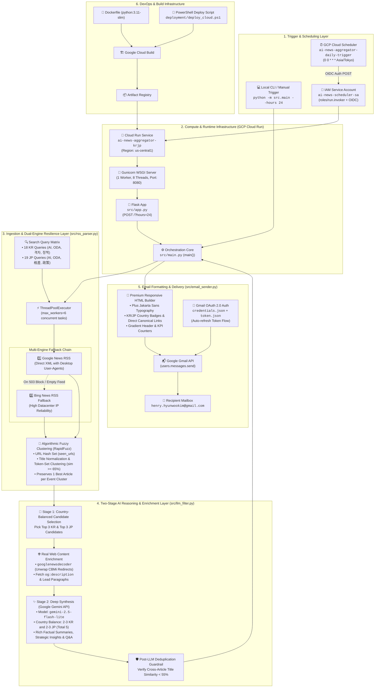

# AIFOD Daily AI News Aggregator (Korea & Japan)

A Python-based serverless service that fetches AI-related news from South Korea and Japan, filters them for relevance to AIFOD's mission, algorithmically deduplicates press releases and similar stories via fuzzy title clustering, enriches candidate articles with real publisher content, translates and deeply synthesizes the top 5 most impactful stories in English with guaranteed country balance (including AIFOD strategic insights and practitioner Q&As), and emails a daily digest to the practitioner every day at midnight (`Asia/Tokyo` time).

Deployed on Google Cloud Run and scheduled via Google Cloud Scheduler.

---

## Architecture & System Flowcharts

### 1. High-Level Infrastructure Overview



---

### 2. Two-Stage AI Selection & Deep Synthesis Pipeline

```mermaid
flowchart TD
    %% Input Articles
    subgraph InputStage ["1. Deduplicated Event Pool (src/rss_parser.py)"]
        RAW_FEED["📥 400+ Raw Articles Fetched"]
        FUZZ_CLUSTER["🧹 RapidFuzz Title Clustering<br/>Group identical press releases into single events"]
        SPLIT_POOLS["👥 Split into Country Pools<br/>• KR Pool (Top 35 Date-Sorted)<br/>• JP Pool (Top 35 Date-Sorted)"]
    end

    %% Stage 1 Candidate Selection
    subgraph Stage1 ["2. Stage 1: Candidate Selection (Gemini API)"]
        S1_PROMPT["🧠 Candidate Selection Prompt<br/>Filter for AIFOD Mission Alignment & Thematic Diversity"]
        S1_SELECT["🎯 Select Top 6 Candidates<br/>(Exactly 3 from KR + 3 from JP)"]
    end

    %% Web Content Enrichment
    subgraph EnrichmentStage ["3. Real Web Content & Canonical URL Enrichment"]
        DECODER["🔓 <code>googlenewsdecoder</code><br/>Unwrap Google News CBMi redirects to canonical publisher URLs"]
        FETCHER["🌐 Parallel Metadata Extraction<br/>Extract <code>og:description</code>, meta descriptions & lead paragraphs (~1000 chars)"]
        ENRICHED_DATA["📑 Enriched Candidate Payloads (6 Articles)"]
    end

    %% Stage 2 Deep Synthesis
    subgraph Stage2 ["4. Stage 2: Deep Factual Synthesis (Gemini API)"]
        S2_PROMPT["🧠 Deep Synthesis Prompt<br/>Enforce country balance (2-3 KR, 2-3 JP) & rich factual density"]
        S2_OUTPUT["📋 Structured JSON Generation:<br/>• english_title<br/>• english_summary (3-4 dense factual sentences)<br/>• aifod_insight (Strategic implications for Global South)<br/>• aifod_question (Critical policy dilemma)<br/>• aifod_suggested_answer (Actionable stance)"]
    end

    %% Post-Guardrail
    subgraph GuardrailStage ["5. Post-Generation Verification Guardrail"]
        SIM_CHECK{"Check Pairwise Title<br/>Similarity < 55%?"}
        POST_VERIFY["✅ Verified Balanced Top 5 Digest"]
        SUB_ALT["🔁 Substitute with Unused Candidate"]
    end

    %% Connections
    RAW_FEED --> FUZZ_CLUSTER --> SPLIT_POOLS
    SPLIT_POOLS --> S1_PROMPT --> S1_SELECT
    S1_SELECT --> DECODER --> FETCHER --> ENRICHED_DATA
    ENRICHED_DATA --> S2_PROMPT --> S2_OUTPUT
    S2_OUTPUT --> SIM_CHECK
    SIM_CHECK -- "Pass" --> POST_VERIFY
    SIM_CHECK -- "Duplicate Found" --> SUB_ALT --> POST_VERIFY
```



---

### 3. Data Ingestion & Fallback Pipeline


---

## Features

- **Resilient Dual-Engine Retrieval**: Queries Google News RSS feeds for South Korea and Japan using AIFOD-targeted keywords. Automatically falls back to Bing News RSS if Google News blocks cloud egress IPs or returns empty feeds.
- **Algorithmic Fuzzy Deduplication**: Eliminates identical press releases across multiple news outlets using RapidFuzz token-set title clustering (`token_set_ratio >= 65`). Merges duplicate coverage into a single best-quality article before AI evaluation.
- **Article Content Enrichment**: Resolves Google News `CBMi...` redirects to canonical publisher URLs via `googlenewsdecoder` and fetches real article metadata (`og:description`, `meta[name="description"]`, and lead paragraphs).
- **Two-Stage Country-Balanced AI Pipeline**:
  - **Stage 1**: Selects 3 candidate stories from South Korea and 3 from Japan.
  - **Stage 2**: Generates a strictly balanced 5-article digest (**2-3 from Korea and 2-3 from Japan**) using rich source text.
- **High-Density AIFOD Deliverables**:
  - **English Summary**: 3-4 dense, factual sentences naming specific actors, partner countries, dates, venues, and policies.
  - **AIFOD Strategic Insight**: Analytical "So What?" highlighting implications for the Global South without restating summary facts.
  - **Practitioner Discussion Q&A**: A forward-looking policy dilemma paired with an actionable stance representing AIFOD's perspective.
- **Premium Email Digests**: Compiles a responsive, beautifully styled HTML email with country badges, direct publisher links, and KPI metrics sent directly via the Gmail API.
- **GCP Serverless Native**: Fully containerized for Google Cloud Run, triggered securely with OIDC authentication by Cloud Scheduler.

---

## File Structure

```text
AI-news-aggregator-KRJP/
├── src/                     # Application Package
│   ├── __init__.py          # Package initialization
│   ├── app.py               # Flask web service entry point for Cloud Run
│   ├── auth.py              # Gmail OAuth authentication helper
│   ├── config.py            # Configuration variables, search queries, API keys
│   ├── email_sender.py      # HTML email generator & Gmail sender
│   ├── llm_filter.py        # Two-stage candidate selection, enrichment & synthesis
│   ├── main.py              # Orchestration pipeline
│   └── rss_parser.py        # Dual-engine RSS fetcher, RapidFuzz clustering, enrichment
├── tests/                   # Automated Unit Tests
│   ├── __init__.py
│   └── test_rss_parser.py   # Unit tests for URL cleaning, title normalization & clustering
├── deployment/
│   └── deploy_cloud.ps1     # PowerShell script to build & deploy to GCP
├── .env                     # Local environment configuration (git-ignored)
├── .env.example             # Template for environment configuration
├── .gcloudignore            # Cloud Build ignore rules
├── .gitignore               # Comprehensive Git ignore rules
├── Dockerfile               # Production container definition (python:3.11-slim)
├── requirements.txt         # Python dependencies
└── README.md                # Project documentation (this file)
```

---

## Local Setup & Execution

### 1. Installation
Clone this repository and install dependencies (Python 3.11+ recommended):

```bash
pip install -r requirements.txt
```

### 2. Configuration
Copy `.env.example` to `.env` and fill in your credentials:

```bash
cp .env.example .env
```

Key environment variables:
- `GEMINI_API_KEY`: Google Gemini API Key (or `GOOGLE_API_KEY`).
- `GCP_PROJECT_ID`: Google Cloud Project ID (e.g. `gen-lang-client-0480639565`).
- `RECIPIENT_EMAIL`: Recipient email (e.g. `henry.hyunwookim@gmail.com`).
- `TIMEZONE`: Timezone for schedule/logs (default `Asia/Tokyo`).

Ensure your Google OAuth client credential files (`credentials.json` and `token.json`) are present in the project root directory.

### 3. Interactive Authentication
If `token.json` is missing or expired, run interactive authentication:

```bash
python -m src.main --auth
```

### 4. Running Unit Tests
Execute the automated test suite:

```bash
python -m unittest discover -s tests
```

### 5. Running the Aggregator Locally
Run a harvest looking back 24 hours (default):

```bash
python -m src.main
```

Run a harvest looking back a custom window (e.g. 48 hours):

```bash
python -m src.main --hours 48
```

---

## Cloud Deployment

Deploying the service to Google Cloud Run and configuring Cloud Scheduler is automated using the deployment script:

```powershell
.\deployment\deploy_cloud.ps1
```

This script will:
1. Enable necessary Google Cloud APIs (`run.googleapis.com`, `cloudbuild.googleapis.com`, etc.).
2. Build the container via Cloud Build and deploy it to **Cloud Run** (`ai-news-aggregator-krjp`).
3. Configure the Service Account (`ai-news-scheduler-sa`) with `roles/run.invoker` permissions.
4. Set up the **Cloud Scheduler Job** (`ai-news-aggregator-daily-trigger`) to trigger the service daily at midnight (`0 0 * * *`) in the `Asia/Tokyo` timezone.

---

## Verification & Manual Trigger

You can manually trigger the deployed Cloud Run service through Cloud Scheduler at any time using `gcloud`:

```bash
gcloud scheduler jobs run ai-news-aggregator-daily-trigger --location=us-central1
```

Check service execution logs in the Google Cloud Console under the **Cloud Run logs tab** for `ai-news-aggregator-krjp`.
