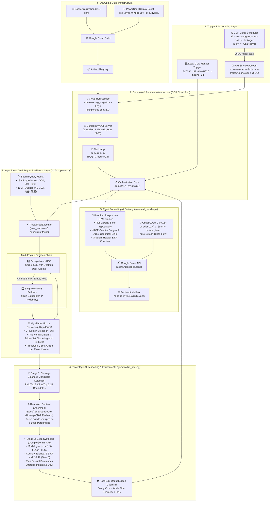

# AIFOD Daily AI News Aggregator (Korea & Japan)

A Python-based serverless service that fetches AI-related news from South Korea and Japan, filters them for relevance to AIFOD's mission, algorithmically deduplicates press releases and similar stories via fuzzy title clustering, enriches candidate articles with real publisher content, translates and deeply synthesizes the top 5 most impactful stories in English with guaranteed country balance (including AIFOD strategic insights and practitioner Q&As), and emails a daily digest to the practitioner every day at midnight (`Asia/Tokyo` time).

Deployed on Google Cloud Run and scheduled via Google Cloud Scheduler.

---

## Architecture & System Flowcharts

### 1. High-Level Infrastructure Overview



---

### 2. Two-Stage AI Selection & Deep Synthesis Pipeline

```mermaid
flowchart TD
    %% Input Articles
    subgraph InputStage ["1. Deduplicated Event Pool (src/rss_parser.py)"]
        RAW_FEED["📥 400+ Raw Articles Fetched"]
        FUZZ_CLUSTER["🧹 RapidFuzz Title Clustering<br/>Group identical press releases into single events"]
        SPLIT_POOLS["👥 Split into Country Pools<br/>• KR Pool (Top 35 Date-Sorted)<br/>• JP Pool (Top 35 Date-Sorted)"]
    end

    %% Stage 1 Candidate Selection
    subgraph Stage1 ["2. Stage 1: Candidate Selection (Gemini API)"]
        S1_PROMPT["🧠 Candidate Selection Prompt<br/>Filter for AIFOD Mission Alignment & Thematic Diversity"]
        S1_SELECT["🎯 Select Top 6 Candidates<br/>(Exactly 3 from KR + 3 from JP)"]
    end

    %% Web Content Enrichment
    subgraph EnrichmentStage ["3. Real Web Content & Canonical URL Enrichment"]
        DECODER["🔓 <code>googlenewsdecoder</code><br/>Unwrap Google News CBMi redirects to canonical publisher URLs"]
        FETCHER["🌐 Parallel Metadata Extraction<br/>Extract <code>og:description</code>, meta descriptions & lead paragraphs (~1000 chars)"]
        ENRICHED_DATA["📑 Enriched Candidate Payloads (6 Articles)"]
    end

    %% Stage 2 Deep Synthesis
    subgraph Stage2 ["4. Stage 2: Deep Factual Synthesis (Gemini API)"]
        S2_PROMPT["🧠 Deep Synthesis Prompt<br/>Enforce country balance (2-3 KR, 2-3 JP) & rich factual density"]
        S2_OUTPUT["📋 Structured JSON Generation:<br/>• english_title<br/>• english_summary (3-4 dense factual sentences)<br/>• aifod_insight (Strategic implications for Global South)<br/>• aifod_question (Critical policy dilemma)<br/>• aifod_suggested_answer (Actionable stance)"]
    end

    %% Post-Guardrail
    subgraph GuardrailStage ["5. Post-Generation Verification Guardrail"]
        SIM_CHECK{"Check Pairwise Title<br/>Similarity < 55%?"}
        POST_VERIFY["✅ Verified Balanced Top 5 Digest"]
        SUB_ALT["🔁 Substitute with Unused Candidate"]
    end

    %% Connections
    RAW_FEED --> FUZZ_CLUSTER --> SPLIT_POOLS
    SPLIT_POOLS --> S1_PROMPT --> S1_SELECT
    S1_SELECT --> DECODER --> FETCHER --> ENRICHED_DATA
    ENRICHED_DATA --> S2_PROMPT --> S2_OUTPUT
    S2_OUTPUT --> SIM_CHECK
    SIM_CHECK -- "Pass" --> POST_VERIFY
    SIM_CHECK -- "Duplicate Found" --> SUB_ALT --> POST_VERIFY
```



---

### 3. Data Ingestion & Fallback Pipeline


---

## Features

- **Resilient Dual-Engine Retrieval**: Queries Google News RSS feeds for South Korea and Japan using AIFOD-targeted keywords. Automatically falls back to Bing News RSS if Google News blocks cloud egress IPs or returns empty feeds.
- **Algorithmic Fuzzy Deduplication**: Eliminates identical press releases across multiple news outlets using RapidFuzz token-set title clustering (`token_set_ratio >= 65`). Merges duplicate coverage into a single best-quality article before AI evaluation.
- **Article Content Enrichment**: Resolves Google News `CBMi...` redirects to canonical publisher URLs via `googlenewsdecoder` and fetches real article metadata (`og:description`, `meta[name="description"]`, and lead paragraphs).
- **Two-Stage Country-Balanced AI Pipeline**:
  - **Stage 1**: Selects 3 candidate stories from South Korea and 3 from Japan.
  - **Stage 2**: Generates a strictly balanced 5-article digest (**2-3 from Korea and 2-3 from Japan**) using rich source text.
- **High-Density AIFOD Deliverables**:
  - **English Summary**: 3-4 dense, factual sentences naming specific actors, partner countries, dates, venues, and policies.
  - **AIFOD Strategic Insight**: Analytical "So What?" highlighting implications for the Global South without restating summary facts.
  - **Practitioner Discussion Q&A**: A forward-looking policy dilemma paired with an actionable stance representing AIFOD's perspective.
- **Premium Email Digests**: Compiles a responsive, beautifully styled HTML email with country badges, direct publisher links, and KPI metrics sent directly via the Gmail API.
- **GCP Serverless Native**: Fully containerized for Google Cloud Run, triggered securely with OIDC authentication by Cloud Scheduler.

---

## 📬 Sample Daily Digest Output Preview

Below is an authentic visual preview of the daily email digest delivered directly to the practitioner's inbox via Gmail, alongside the underlying structured JSON schema produced by the two-stage Gemini synthesis engine.

### 1. Visual Email Digest Preview

<div align="center">
  <table width="100%" style="max-width: 680px; border-collapse: collapse; border: 1px solid #cbd5e1; border-radius: 12px; overflow: hidden; font-family: -apple-system, BlinkMacSystemFont, 'Segoe UI', Roboto, Helvetica, Arial, sans-serif;">
    <thead>
      <tr style="background: linear-gradient(135deg, #1e3a8a 0%, #3b82f6 50%, #8b5cf6 100%); color: #ffffff;">
        <th style="padding: 24px 20px; text-align: center; border: none;">
          <div style="font-size: 11px; letter-spacing: 0.15em; text-transform: uppercase; color: #93c5fd; font-weight: 700; margin-bottom: 6px;">AIFOD Daily Intelligence Briefing</div>
          <div style="font-size: 24px; font-weight: 800; margin: 0 0 6px 0; color: #ffffff;">Korea &amp; Japan AI News</div>
          <div style="font-size: 13px; font-weight: 400; color: #e0f2fe;">Selected and synthesized for international development relevance and policy strategy.</div>
        </th>
      </tr>
      <tr style="background-color: #f8fafc; border-bottom: 1px solid #e2e8f0; color: #475569; font-size: 12px;">
        <th style="padding: 12px 16px; text-align: center; border: none;">
          <strong>Evaluated:</strong> 248 articles &nbsp;|&nbsp; <strong>Selected:</strong> 5 stories &nbsp;|&nbsp; <strong>Country Balance:</strong> 🇰🇷 3 Korea &nbsp;·&nbsp; 🇯🇵 2 Japan &nbsp;|&nbsp; <strong>Date:</strong> Sep 16, 2026
        </th>
      </tr>
    </thead>
    <tbody style="background-color: #ffffff;">
      <!-- Article 1 (South Korea) -->
      <tr>
        <td style="padding: 22px 24px; border-bottom: 1px solid #e2e8f0; text-align: left;">
          <div style="margin-bottom: 8px;">
            <span style="background-color: #e0f2fe; color: #0369a1; padding: 3px 10px; border-radius: 9999px; font-size: 11px; font-weight: 700; letter-spacing: 0.05em; text-transform: uppercase;">🇰🇷 South Korea</span>
            &nbsp;
            <span style="color: #64748b; font-size: 12px;">Yonhap News &bull; Sep 16, 02:30 UTC</span>
          </div>
          <div style="font-size: 17px; font-weight: 700; margin: 6px 0 3px 0;">
            <a href="https://en.yna.co.kr" target="_blank" style="color: #1e3a8a; text-decoration: none;">South Korea's MSIT and KOICA Launch $45M AI Capacity-Building Initiative for ASEAN Partner Nations</a>
          </div>
          <div style="font-size: 11px; color: #94a3b8; font-style: italic; margin-bottom: 12px;">
            Original: 과기정통부-KOICA, 아세안 개도국 대상 600억원 규모 디지털 AI 역량강화 ODA 사업 착수
          </div>
          <p style="font-size: 13.5px; line-height: 1.6; color: #334155; margin: 0 0 14px 0;">
            South Korea's Ministry of Science and ICT (MSIT), in partnership with KOICA, officially launched a 60 billion KRW ($45M) multi-year ODA initiative on September 15, 2026, aimed at establishing sovereign AI training centers across Indonesia, Vietnam, and the Philippines. The program deploys open-source Korean large language models fine-tuned on local Southeast Asian languages alongside cloud compute subsidies and technical faculty training. Pilot programs will commence in Q1 2027 in Jakarta and Hanoi to develop public sector AI services for healthcare and agricultural monitoring.
          </p>
          <!-- AIFOD Strategic Insight Card -->
          <div style="background-color: #f5f3ff; border-left: 4px solid #8b5cf6; padding: 12px 14px; border-radius: 0 8px 8px 0; margin-bottom: 12px;">
            <div style="color: #6d28d9; font-size: 11px; font-weight: 700; text-transform: uppercase; letter-spacing: 0.05em; margin-bottom: 4px;">AIFOD Strategic Insight</div>
            <div style="color: #4c1d95; font-size: 13px; line-height: 1.5;">
              This initiative reflects a crucial shift from generic ICT hardware donations toward high-value sovereign AI capability building in the Global South. For AIFOD, the focus on local language fine-tuning and public sector use cases provides an actionable precedent for avoiding technological dependency on single-nation proprietary LLMs.
            </div>
          </div>
          <!-- Practitioner Q&A Card -->
          <div style="background-color: #f0fdf4; border: 1px solid #bbf7d0; border-radius: 8px; padding: 12px 14px;">
            <div style="color: #166534; font-size: 11px; font-weight: 700; text-transform: uppercase; letter-spacing: 0.05em; margin-bottom: 4px;">Practitioner Q&amp;A &amp; Stance</div>
            <div style="font-size: 13px; color: #166534; margin-bottom: 6px;">
              <strong>Q: How can developing nation partner agencies prevent compute infrastructure gifts from becoming unsustainable once foreign donor subsidies expire?</strong>
            </div>
            <div style="font-size: 13px; color: #14532d; line-height: 1.5; padding-left: 12px; border-left: 2px solid #86efac; font-style: italic;">
              <strong>AIFOD Stance:</strong> Multilateral ODA agreements must incorporate tiered local financing roadmaps and prioritize energy-efficient, edge-deployable open-weights models rather than relying indefinitely on recurring high-overhead cloud computing grants.
            </div>
          </div>
        </td>
      </tr>
      <!-- Article 2 (Japan) -->
      <tr>
        <td style="padding: 22px 24px; text-align: left;">
          <div style="margin-bottom: 8px;">
            <span style="background-color: #fee2e2; color: #b91c1c; padding: 3px 10px; border-radius: 9999px; font-size: 11px; font-weight: 700; letter-spacing: 0.05em; text-transform: uppercase;">🇯🇵 Japan</span>
            &nbsp;
            <span style="color: #64748b; font-size: 12px;">Nikkei Asia &bull; Sep 16, 04:15 UTC</span>
          </div>
          <div style="font-size: 17px; font-weight: 700; margin: 6px 0 3px 0;">
            <a href="https://asia.nikkei.com" target="_blank" style="color: #1e3a8a; text-decoration: none;">Japan's METI and JICA Partner on AI Governance Framework for Global South Industrial Cooperation</a>
          </div>
          <div style="font-size: 11px; color: #94a3b8; font-style: italic; margin-bottom: 12px;">
            Original: 経済産業省とJICA、グローバルサウス向けAIガバナンス指針と産業応用支援枠組みを共同策定
          </div>
          <p style="font-size: 13.5px; line-height: 1.6; color: #334155; margin: 0 0 14px 0;">
            Japan's Ministry of Economy, Trade and Industry (METI) and JICA unveiled a comprehensive AI governance guideline on September 15, 2026, specifically tailored for emerging economies across South and Southeast Asia. The framework provides risk-based safety standards aligned with the Hiroshima AI Process while establishing collaborative testing testbeds for SME manufacturing and disaster risk prediction. JICA has earmarked 18 billion JPY over three fiscal years to assist partner ministries in developing their own national regulatory sandboxes.
          </p>
          <!-- AIFOD Strategic Insight Card -->
          <div style="background-color: #f5f3ff; border-left: 4px solid #8b5cf6; padding: 12px 14px; border-radius: 0 8px 8px 0; margin-bottom: 12px;">
            <div style="color: #6d28d9; font-size: 11px; font-weight: 700; text-transform: uppercase; letter-spacing: 0.05em; margin-bottom: 4px;">AIFOD Strategic Insight</div>
            <div style="color: #4c1d95; font-size: 13px; line-height: 1.5;">
              Aligning developing economy AI frameworks with the Hiroshima AI Process helps Global South economies participate in global AI supply chains without premature over-regulation. AIFOD practitioners should leverage these Japanese bilateral sandboxes to advocate for inclusive IP protections and local algorithmic fairness standards.
            </div>
          </div>
          <!-- Practitioner Q&A Card -->
          <div style="background-color: #f0fdf4; border: 1px solid #bbf7d0; border-radius: 8px; padding: 12px 14px;">
            <div style="color: #166534; font-size: 11px; font-weight: 700; text-transform: uppercase; letter-spacing: 0.05em; margin-bottom: 4px;">Practitioner Q&amp;A &amp; Stance</div>
            <div style="font-size: 13px; color: #166534; margin-bottom: 6px;">
              <strong>Q: How can developing nation regulators balance rigorous AI risk compliance with urgent local economic innovation demands?</strong>
            </div>
            <div style="font-size: 13px; color: #14532d; line-height: 1.5; padding-left: 12px; border-left: 2px solid #86efac; font-style: italic;">
              <strong>AIFOD Stance:</strong> Regulators should adopt agile sandbox models that grant provisional compliance exemptions to high-impact developmental use cases (such as agricultural AI and micro-finance credit scoring) while retaining strict safeguards for citizen biometric data.
            </div>
          </div>
        </td>
      </tr>
    </tbody>
  </table>
</div>

### 2. Structured JSON Output Contract (Stage 2 AI Synthesis)

The Gemini Stage 2 reasoning engine outputs a strictly validated JSON structure consumed by [src/email_sender.py](file:///c:/Users/hyunwookim/OneDrive%20-%20GAFS/%E3%83%89%E3%82%AD%E3%83%A5%E3%83%A1%E3%83%B3%E3%83%88/GitHub/AI-news-aggregator-KRJP/src/email_sender.py) to compile the HTML template:

```json
{
  "articles": [
    {
      "candidate_index": 0,
      "country": "KR",
      "original_title": "과기정통부-KOICA, 아세안 개도국 대상 600억원 규모 디지털 AI 역량강화 ODA 사업 착수",
      "source": "Yonhap News",
      "link": "https://en.yna.co.kr/view/AEN20260916001200320",
      "published": "2026-09-16T02:30:00+00:00",
      "english_title": "South Korea's MSIT and KOICA Launch $45M AI Capacity-Building Initiative for ASEAN Partner Nations",
      "english_summary": "South Korea's Ministry of Science and ICT (MSIT), in partnership with KOICA, officially launched a 60 billion KRW ($45M) multi-year ODA initiative on September 15, 2026, aimed at establishing sovereign AI training centers across Indonesia, Vietnam, and the Philippines. The program deploys open-source Korean large language models fine-tuned on local Southeast Asian languages alongside cloud compute subsidies and technical faculty training. Pilot programs will commence in Q1 2027 in Jakarta and Hanoi to develop public sector AI services for healthcare and agricultural monitoring.",
      "aifod_insight": "This initiative reflects a crucial shift from generic ICT hardware donations toward high-value sovereign AI capability building in the Global South. For AIFOD, the focus on local language fine-tuning and public sector use cases provides an actionable precedent for avoiding technological dependency on single-nation proprietary LLMs.",
      "aifod_question": "How can developing nation partner agencies prevent compute infrastructure gifts from becoming unsustainable once foreign donor subsidies expire?",
      "aifod_suggested_answer": "Multilateral ODA agreements must incorporate tiered local financing roadmaps and prioritize energy-efficient, edge-deployable open-weights models rather than relying indefinitely on recurring high-overhead cloud computing grants."
    }
  ]
}
```

---

## Project Structure

```text
AI-news-aggregator-KRJP/
├── src/                               # Application Package
│   ├── __init__.py                    # Package initialization
│   ├── app.py                         # Flask web service entry point for Cloud Run
│   ├── auth.py                        # Gmail OAuth authentication helper & token refresh
│   ├── config.py                      # Configuration variables, search queries, API keys
│   ├── email_sender.py                # HTML email generator & Gmail REST API sender
│   ├── llm_filter.py                  # Two-stage candidate selection, enrichment & synthesis
│   ├── main.py                        # Orchestration pipeline & CLI entrypoint
│   └── rss_parser.py                  # Dual-engine RSS fetcher, RapidFuzz clustering, enrichment
├── tests/                             # Automated Unit Tests
│   ├── __init__.py
│   └── test_rss_parser.py             # Unit tests for URL cleaning, title normalization & clustering
├── deployment/
│   └── deploy_cloud.ps1               # Advanced PowerShell script to build & deploy to GCP
├── .env                               # Local environment configuration (git-ignored)
├── .env.example                       # Template for environment configuration
├── .gcloudignore                      # Cloud Build ignore rules
├── .gitignore                         # Comprehensive Git ignore rules
├── Dockerfile                         # Production container definition (python:3.11-slim)
├── LICENSE                            # MIT License definition
├── requirements.txt                   # Python dependencies
└── README.md                          # Project documentation (this file)
```

Key files:
- [src/main.py](file:///c:/Users/hyunwookim/OneDrive%20-%20GAFS/%E3%83%89%E3%82%AD%E3%83%A5%E3%83%A1%E3%83%B3%E3%83%88/GitHub/AI-news-aggregator-KRJP/src/main.py): Primary entry point coordinating authentication, ingestion, filtering, and dispatch.
- [src/rss_parser.py](file:///c:/Users/hyunwookim/OneDrive%20-%20GAFS/%E3%83%89%E3%82%AD%E3%83%A5%E3%83%A1%E3%83%B3%E3%83%88/GitHub/AI-news-aggregator-KRJP/src/rss_parser.py): RSS parsing, multi-engine fallback, RapidFuzz deduplication, and page scraping.
- [src/llm_filter.py](file:///c:/Users/hyunwookim/OneDrive%20-%20GAFS/%E3%83%89%E3%82%AD%E3%83%A5%E3%83%A1%E3%83%B3%E3%83%88/GitHub/AI-news-aggregator-KRJP/src/llm_filter.py): Two-stage Gemini prompt orchestration, country balancing, and guardrails.
- [src/email_sender.py](file:///c:/Users/hyunwookim/OneDrive%20-%20GAFS/%E3%83%89%E3%82%AD%E3%83%A5%E3%83%A1%E3%83%B3%E3%83%88/GitHub/AI-news-aggregator-KRJP/src/email_sender.py): Modern Plus Jakarta Sans responsive HTML email builder and Gmail API sender.
- [deployment/deploy_cloud.ps1](file:///c:/Users/hyunwookim/OneDrive%20-%20GAFS/%E3%83%89%E3%82%AD%E3%83%A5%E3%83%A1%E3%83%B3%E3%83%88/GitHub/AI-news-aggregator-KRJP/deployment/deploy_cloud.ps1): Automated deployment script for Cloud Run, IAM invoker service account, and Cloud Scheduler.

---

## Configuration & Environment Variables

Create a local `.env` file based on [.env.example](file:///c:/Users/hyunwookim/OneDrive%20-%20GAFS/%E3%83%89%E3%82%AD%E3%83%A5%E3%83%A1%E3%83%B3%E3%83%88/GitHub/AI-news-aggregator-KRJP/.env.example):

| Variable | Description | Default / Example | Required |
|---|---|---|---|
| `GEMINI_API_KEY` | Google Gemini Generative AI API Key | `AIzaSy...` | Yes |
| `GCP_PROJECT_ID` | Google Cloud Project ID for deployment | `your-gcp-project-id` | Yes (for deployment) |
| `GCP_REGION` | Cloud Run and Scheduler region | `us-central1` | No |
| `SERVICE_NAME` | Cloud Run service name | `ai-news-aggregator-krjp` | No |
| `JOB_NAME` | Cloud Scheduler job identifier | `ai-news-aggregator-daily-trigger` | No |
| `SCHEDULE` | Cron expression for daily trigger | `0 0 * * *` (midnight) | No |
| `TIMEZONE` | Timezone for report date and scheduler | `Asia/Tokyo` | No |
| `RECIPIENT_EMAIL` | Target email for daily digest | `your_email@example.com` | Yes |
| `RECIPIENT_NAME` | Target recipient name in digest footer | `AIFOD Practitioner` | No |

OAuth 2.0 Credentials:
- `credentials.json`: OAuth Client ID credentials file downloaded from Google Cloud Console (APIs & Services > Credentials).
- `token.json`: Generated upon successful authentication containing access and refresh tokens.

---

## Local Setup & Execution

### 1. Installation
Clone the repository and install dependencies (Python 3.11+ recommended):

```bash
pip install -r requirements.txt
```

### 2. Configuration Setup
Copy `.env.example` to `.env` and fill in your keys:

```bash
cp .env.example .env
```

Ensure `credentials.json` is placed in the project root.

### 3. Interactive Authentication
If `token.json` is missing or expired, initiate the interactive OAuth consent flow in your local browser:

```bash
python -m src.main --auth
```

### 4. Running Automated Unit Tests
Execute the unit test suite verifying URL parsing and RapidFuzz deduplication clustering:

```bash
python -m unittest discover -s tests
```

### 5. Running the Aggregator Locally
Run a daily news harvest looking back 24 hours (default):

```bash
python -m src.main
```

Run a harvest looking back a custom window (e.g. 48 hours):

```bash
python -m src.main --hours 48
```

Run the local web server container test:

```bash
python -m src.app
```

---

## Cloud Deployment (Google Cloud Run & Cloud Scheduler)

Automated deployment to Google Cloud Platform is managed via the PowerShell deployment script:

```powershell
.\deployment\deploy_cloud.ps1
```

You can also pass explicit parameters to override `.env` defaults:

```powershell
.\deployment\deploy_cloud.ps1 -ProjectId "your-gcp-project" -Region "us-central1" -ServiceName "ai-news-aggregator-krjp"
```

### What the Deployment Script Does:
1. **API Enablement**: Enables `run.googleapis.com`, `cloudbuild.googleapis.com`, `artifactregistry.googleapis.com`, and `cloudscheduler.googleapis.com`.
2. **Container Build & Deploy**: Uses Google Cloud Build to containerize the source tree with [Dockerfile](file:///c:/Users/hyunwookim/OneDrive%20-%20GAFS/%E3%83%89%E3%82%AD%E3%83%A5%E3%83%A1%E3%83%B3%E3%83%88/GitHub/AI-news-aggregator-KRJP/Dockerfile) and deploy it as a private, authenticated service to Cloud Run.
3. **IAM Service Account Setup**: Creates or verifies the dedicated service account `ai-news-scheduler-sa` and binds the `roles/run.invoker` role to the Cloud Run service.
4. **Cloud Scheduler Job**: Configures an HTTP POST recurring trigger (`0 0 * * *` in `Asia/Tokyo`) that sends an OIDC authorization token to invoke the Cloud Run endpoint.

---

## Verification & Manual Trigger

You can manually trigger the deployed Cloud Run service through Cloud Scheduler at any time using `gcloud`:

```bash
gcloud scheduler jobs run ai-news-aggregator-daily-trigger --location=us-central1
```

To view live Cloud Run execution logs:

```bash
gcloud beta run services logs tail ai-news-aggregator-krjp --region=us-central1
```

---

## License

This project is licensed under the [MIT License](file:///c:/Users/hyunwookim/OneDrive%20-%20GAFS/ドキュメント/GitHub/AI-news-aggregator-KRJP/LICENSE).

