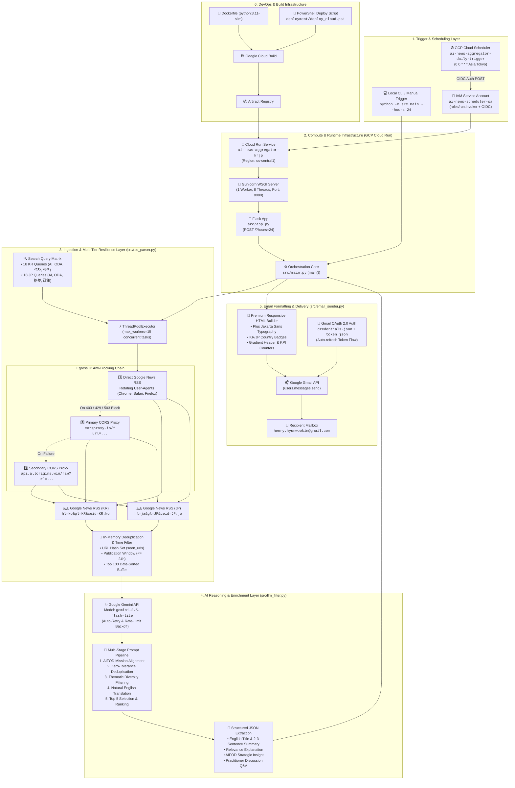
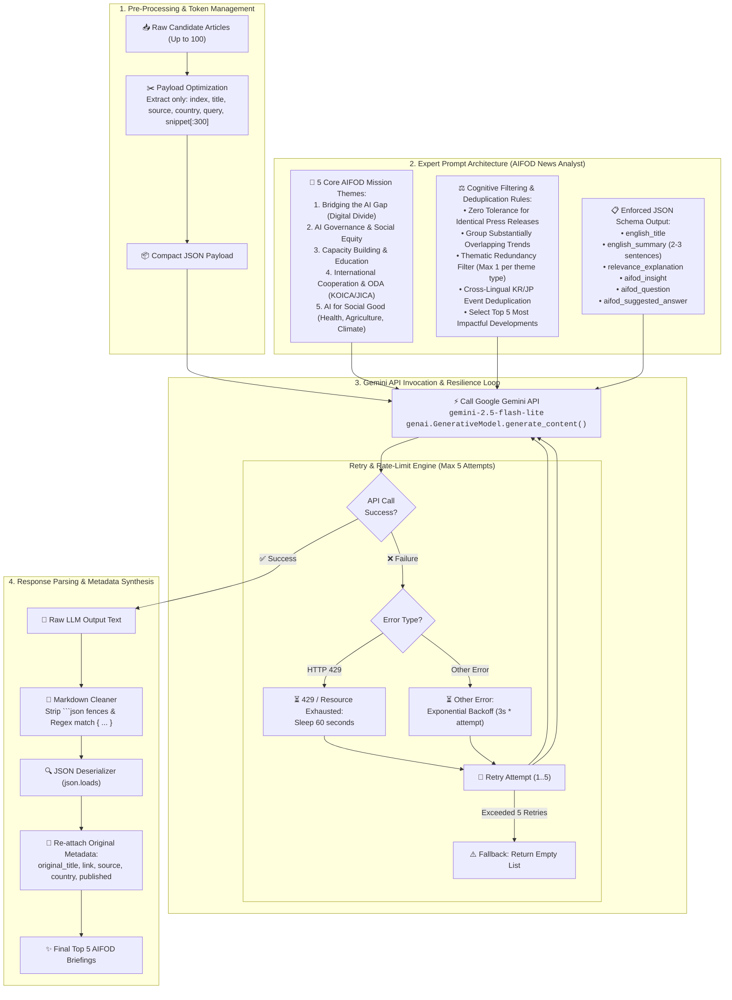
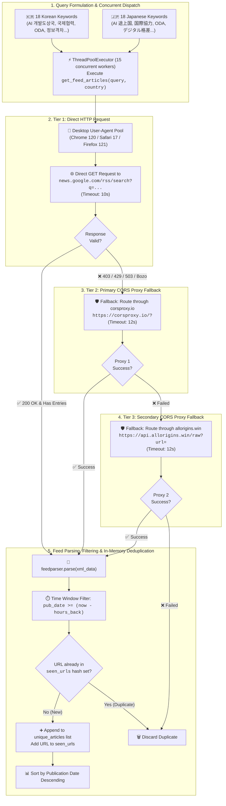
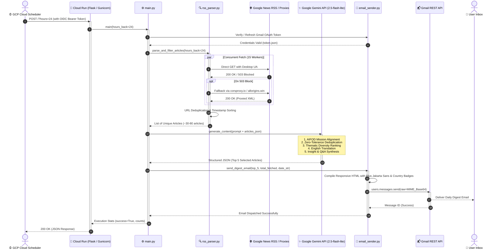

# AIFOD Daily AI News Aggregator (Korea & Japan)

A Python-based serverless service that fetches AI-related news from South Korea and Japan, filters them for relevance to AIFOD's mission, aggressively deduplicates similar coverages, translates and summarizes the top 5 most impactful stories in English (including adding AIFOD policy insights and discussion Q&As), and emails a daily digest to the practitioner every day at midnight (Asia/Tokyo time).

Deployed on Google Cloud Run and scheduled via Google Cloud Scheduler.

---

## Architecture & System Flowcharts

### 1. High-Level Infrastructure Overview



---

### 2. Google Gemini AI Reasoning & Value-Add Pipeline



---

### 3. Data Ingestion & Anti-Blocking Fallback Pipeline



---

### 4. End-to-End API Sequence Diagram



---

## Features

- **Resilient Multilingual Retrieval**: Automatically queries Google News RSS feeds for South Korea (in Korean) and Japan (in Japanese) using AIFOD-targeted keywords. Implements rotating browser User-Agents and multiple public CORS proxy fallbacks (`corsproxy.io` and `allorigins.win`) to bypass Google News `503 Service Unavailable` IP blocks on Google Cloud datacenter egress ranges.
- **AIFOD-Focused Filtering & Deduplication**: Uses the Gemini API (`gemini-2.5-flash-lite`) to filter articles strictly relevant to AIFOD's mission (bridging the digital divide, AI policy in emerging markets, capacity building, and international cooperation). It aggressively deduplicates similar or overlapping stories across both countries and sources, selecting the top 5 most significant developments of the day.
- **AIFOD Value-Adds**: For each of the top 5 articles, Gemini generates:
  - A 2-3 sentence English summary.
  - An analytical paragraph explaining the significance/implication of the news specifically for AIFOD.
  - A critical question that AIFOD practitioners should ask regarding the development.
  - A suggested stance/response representing AIFOD's perspective.
- **Premium Email Digests**: Compiles a responsive, beautifully styled HTML email with country-specific badges, relevance markers, and clean layouts sent directly via the Gmail API.
- **GCP Native**: Fully containerized and deployed on Google Cloud Run, triggered securely with OIDC authentication by Cloud Scheduler.

---

## File Structure

```text
├── src/
│   ├── __init__.py
│   ├── app.py           # Flask web service entry point for Cloud Run
│   ├── auth.py          # Gmail OAuth authentication helper
│   ├── config.py        # Configuration variables & search query keywords
│   ├── email_sender.py  # HTML email generator & Gmail sender
│   ├── llm_filter.py    # Gemini filtering, translation, and AIFOD analysis
│   ├── main.py          # Orchestration pipeline
│   └── rss_parser.py    # RSS parsing & filtering by publication time
├── deployment/
│   └── deploy_cloud.ps1 # PowerShell script to build & deploy to GCP
├── .env                 # Local environment configuration (git-ignored)
├── .env.example         # Template for environment configuration
├── .gcloudignore        # Custom ignore rules to copy credentials during builds
├── .gitignore           # Git ignore rules
├── Dockerfile           # Container build file
├── requirements.txt     # Python dependencies
└── README.md            # Project documentation (this file)
```

---

## Local Setup & Execution

### 1. Installation
Clone this repository and install the dependencies (Python 3.11+ recommended):

```bash
pip install -r requirements.txt
```

### 2. Configuration
Copy the `.env.example` file to `.env` and fill in your credentials:
- `GEMINI_API_KEY`: Google AI Gemini API Key.
- `GCP_PROJECT_ID`: Google Cloud Project ID.
- `RECIPIENT_EMAIL`: Recipient email (e.g., `henry.hyunwookim@gmail.com`).

Make sure your Google OAuth client credential files (`credentials.json` and `token.json`) are present in the project root directory.

### 3. Interactive Authentication
If `token.json` is expired or missing, run the following command in an interactive terminal to perform the Gmail OAuth login flow in your browser:

```bash
python -m src.main --auth
```

### 4. Running Locally
To run a test harvest locally (default is last 24 hours):

```bash
python -m src.main
```

To run a test harvest looking back a specific number of hours (e.g. 48 hours):

```bash
python -m src.main --hours 48
```

---

## Cloud Deployment

Deploying the service to Google Cloud Run and configuring Cloud Scheduler is automated using the deployment script:

```powershell
.\deployment\deploy_cloud.ps1
```

This script will:
1. Enable necessary Google Cloud APIs (`run.googleapis.com`, `cloudbuild.googleapis.com`, etc.).
2. Submit a build to Cloud Build, compile the container, and deploy it to **Cloud Run** (`ai-news-aggregator-krjp`).
3. Set up a secure Service Account (`ai-news-scheduler-sa`) with permissions to invoke the Cloud Run service.
4. Create or update a **Cloud Scheduler Job** (`ai-news-aggregator-daily-trigger`) configured to trigger the service daily at midnight (`0 0 * * *`) in the `Asia/Tokyo` timezone.

---

## Verification & Manual Trigger

You can manually trigger the deployed Cloud Run service through Cloud Scheduler at any time using `gcloud`:

```bash
gcloud scheduler jobs run ai-news-aggregator-daily-trigger --location=us-central1
```

Check the execution logs of your service in the Google Cloud Console under the **Cloud Run logs tab** for `ai-news-aggregator-krjp`.
